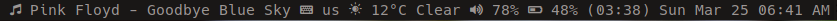

onpar
---

A dwm bar that is on par with other advanced bars such as i3blocks and polybar

## Features

- The ability to schedule running each function independently
- The extensibility to write any script and use its STDOUT and show it on the bar
- Currently shows date and time, battery level, volume level, DarkSky weather
  forecast, keyboard layout, current music track

## Requirements

- [Go installation](http://golang.org/)
- [FontAwesome](https://fontawesome.com)
- [icons-in-terminal](https://github.com/sebastiencs/icons-in-terminal)

## Installation

- Run `sudo make install` to build the components into a `bin/` directory and
  to copy the executable `onpar` into `/usr/local/bin`
- Add the `bin/` directory to your $PATH
- Run `make run` to run the executable

## Customization

- To start `onpar` with system startup, Add `onpar&` to your `.xinitrc` or to
  your system's startup config file
- To add more components, add them to `components` directory, and call them in
  the code of `onpar`, then redo the installation steps

## TODOs

- [X] Make it configurable
- [] Add support for colors
- [X] Add icons
- [] Revisit the use of goroutines and the possibility to use alarm signals instead
- [X] Refactor the code
- [] Add a way to log runtime errors
- [] Add a config file

## License

See [LICENSE](https://github.com/aonemd/onpar/blob/master/LICENSE).
